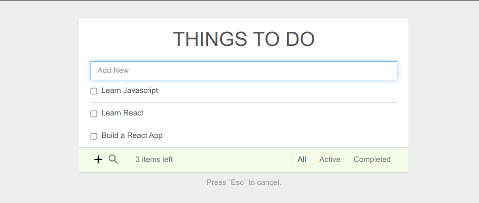

# TODO React App using Bun

### This app is build using Bun package manager which is much faster than npm

---
## Requirements

Bun package manager 
* [Bun.sh](https://bun.sh/)

## Install

    $ git clone https://github.com/ravi0900/todo-react-app.git
    $ cd todo-react-app
    $ bun install

## Running the project

    $ bun start

